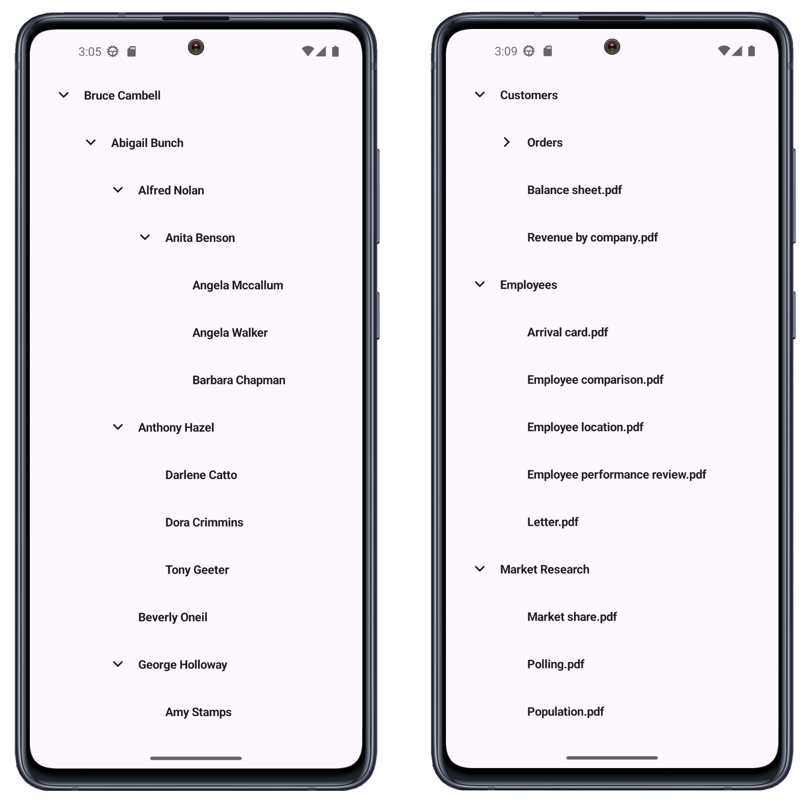

<!-- default badges list -->

<!-- default badges end -->

# DevExpress Tree View for .NET MAUI

The **DevExpress .NET MAUI** TreeView control ([DXTreeView](https://docs.devexpress.com/MAUI/DevExpress.Maui.TreeView.DXTreeView)) ships as part of the [DevExpress .NET MAUI Mobile UI component suite](https://www.devexpress.com/maui/).

For a limited time, our **.NET MAUI Mobile UI component suite** is available free of charge. To learn more about this free offer and obtain your copy, visit the following page: [Free Offer - DevExpress Mobile UI for .NET MAUI](https://www.devexpress.com/xamarin-free).

## Requirements

Register your DevExpress NuGet Feed within Visual Studio to restore packages used in this solution. Review the following article for additional information: [Get Started with DevExpress Mobile UI for .NET MAUI](https://docs.devexpress.com/MAUI/403249/get-started). 

Watch the following YouTube video to get started with DevExpress .NET MAUI controls: [Setting up a .NET MAUI Project](https://www.youtube.com/watch?v=juJvl5UicIQ).

## What's in This Repository

This repository contains projects designed to populate the DevExpress .NET MAUI TreeView control with both [self-referenced (flat)](https://docs.devexpress.com/MAUI/404899/tree-view/display-hierarchical-data#self-referenсed-data-structure) and [hierarchical](https://docs.devexpress.com/MAUI/404899/tree-view/display-hierarchical-data#hierarchical-data-structure) data.
 
* [Bind the .NET MAUI TreeView to Self-Referenced Data ](/CS/TreeViewWithSelfReferenceData/)
* [Bind the .NET MAUI TreeView to Hierarchical Data](/CS/TreeViewWithHierarchicalData/)

## Documentation

- [Tree View](https://docs.devexpress.com/MAUI/404896/tree-view)

## More Examples

* [Stocks App](https://github.com/DevExpress-Examples/maui-stocks-mini)
* [Data Form](https://github.com/DevExpress-Examples/maui-data-form-get-started)
* [Data Editors](https://github.com/DevExpress-Examples/maui-editors-get-started)
* [Data Grid](https://github.com/DevExpress-Examples/maui-data-grid)
* [Collection View](https://github.com/DevExpress-Examples/maui-collection-view)
* [Charts](https://github.com/DevExpress-Examples/maui-charts)
* [Scheduler](https://github.com/DevExpress-Examples/maui-scheduler-get-started)
* [Tab Page](https://github.com/DevExpress-Examples/maui-tab-page-get-started)
* [Tab View](https://github.com/DevExpress-Examples/maui-tab-view-get-started)
* [Drawer Page](https://github.com/DevExpress-Examples/maui-drawer-page-get-started)
* [Drawer View](https://github.com/DevExpress-Examples/maui-drawer-view-get-started)
* [Collection View](https://github.com/DevExpress-Examples/maui-collection-view-get-started)
* [Popup](https://github.com/DevExpress-Examples/maui-popup-get-started)
<!-- feedback -->
## Does this example address your development requirements/objectives?

 

(you will be redirected to DevExpress.com to submit your response)
<!-- feedback end -->
